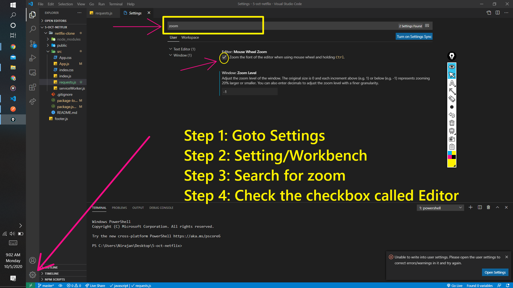

# Display
{:.no_toc}

This page contains all of the information on setting up VS Code display how I prefer it.

* TOC
{:toc}

### File Explorer

The indentation size on the file explorer is really really small on some high resolution monitors, so increasing it can help with navigation a whole lot. To do this, change the indent setting to something higher (in pixels). 25 is typically pretty good.

```json
"workbench.tree.indent": 25
```

### Miscellaneous

A sort of random collection of tips and tricks.

#### Single Page Display Scaling

##### Motivation

My motivation for this is that I have multiple monitors with different resolutions. VS Code's default setting is to keep the same zoom level consistent across all monitors which I dislike.

##### Solution



1. Go to settings in the lower right hand corner.
2. Click the settings dialog from the popup menu (or hit <kbd>Ctrl</kbd> + <kbd>,</kbd>).
3. Search for "zoom".
4. Chech the checkbox called "Editor".

Unfortunately, this only works for mouse zooming, the keyboard zooming still affects all VS Code instances. However, I can live with this solution.